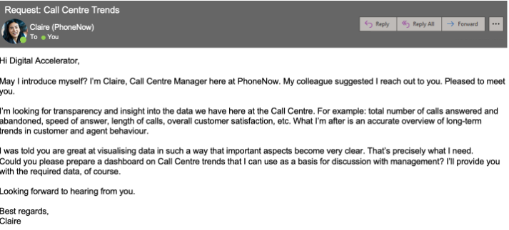
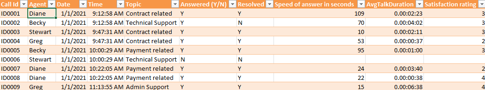
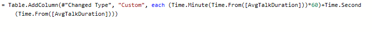
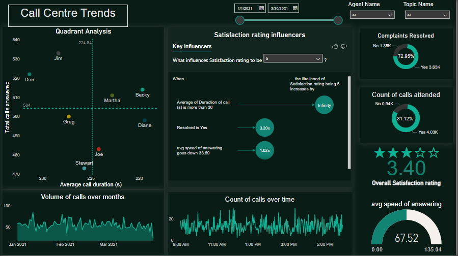

# PwC-Power-BI-Virtual-Internship
Call Center Data Analysis

## Business Request
The business request in the form of an email for the project was as follows:

  

The data set provided contained one table with the following columns:

  

In PowerQuery the avg call duration was converting into seconds from the format it was originally in using the following:

  

The dashboard built is as follows and the link to it online can be found [here](https://app.powerbi.com/links/_VaGrpLkbh?ctid=402d2a37-422a-4cb6-9563-6afdf0cd3a39&pbi_source=linkShare):

  

A quadrant analysis was done with the average call duration on the x axis (inverted) and total calls answered on the y axis and agent names were used as the data values to see different agent's performance and effeciency. 

Filters were created for agent name, for the time and for the topic that was addressed by the agent. 

